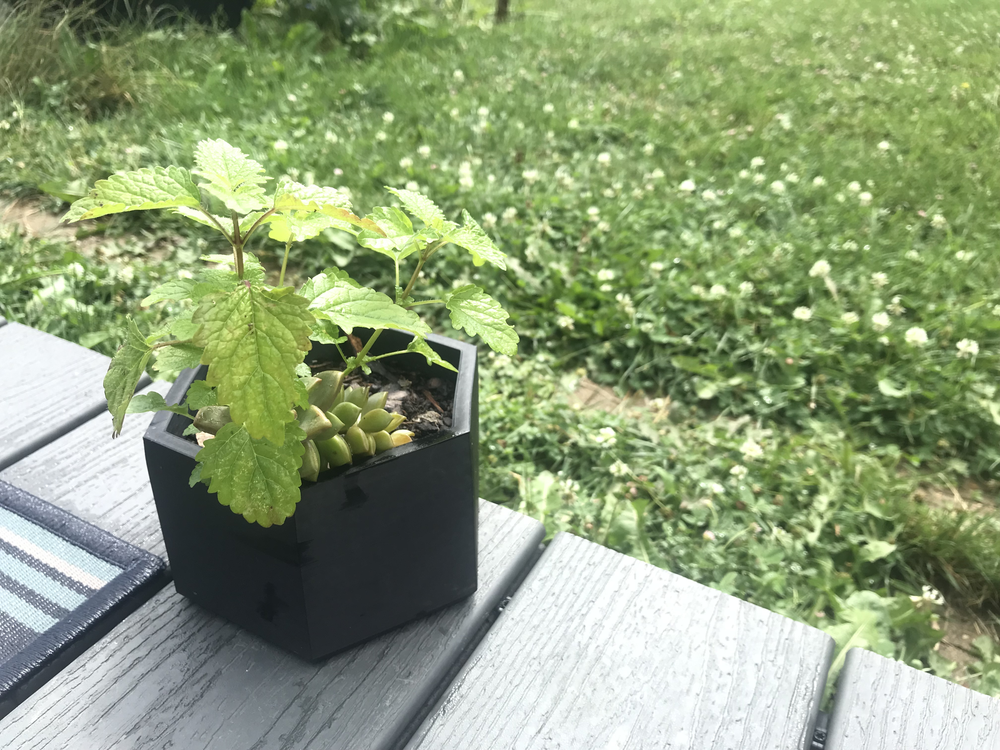

# OpenGarden
 OpenGarden is an ongoing project to create simple aesthetically pleasing garden planters. These designs can look nice in anybody's yard or home! Designs such as the ones shown below and more to come are free and open source. More planters based on pleasing geometric designs are in the works along with small garden beds, which can all be 3D printed on standard bed sizes. All of my designs are based around the fairly common bed size of the Ender3V2 3D printer. Thank you for visiting!

My tool of choice for creating these planters is the free open source software OpenSCAD, which uses a C based programming language in order to generate designs, which can be rendered inside of the software. 
